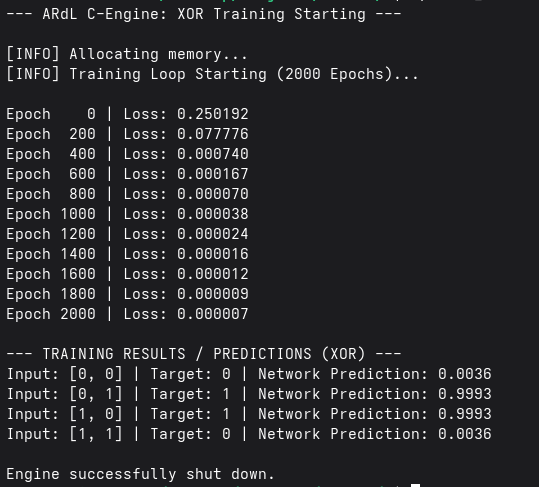

# ARdL C-Engine 🧠

A **high-performance neural network engine written in pure C**, designed with a strict **hardware-first philosophy**.

ARdL eliminates heavy abstractions found in modern ML frameworks and focuses on **deterministic memory usage, cache-efficient computation, and embedded system compatibility**.

---

## 🚀 Core Principles

ARdL is built around three fundamental ideas:

* **Deterministic Memory Usage** – no runtime allocation overhead
* **Cache Efficiency** – optimized for modern CPU memory hierarchies
* **Low-Level Control** – predictable, transparent execution

---

## ⚡ Key Features

### 🔒 Deterministic Memory Execution

* No `malloc` / `free` calls inside the training loop
* All memory is preallocated during initialization
* No fragmentation or unpredictable allocation latency
* Fully reproducible memory behavior

> Designed for systems where **memory predictability is critical** (e.g., microcontrollers)

---

### 🧠 Custom Arena Allocator

ARdL implements a lightweight **arena-based memory allocator**:

* Single contiguous memory block
* Linear allocation using pointer offset
* Constant-time allocation
* Resettable memory region

**Example (XOR model):**

```
Total memory usage: ~896 bytes
```

This enables:

* Minimal memory footprint
* High allocation speed
* Complete control over memory layout

---

### ⚙️ Cache-Optimized Matrix Operations

Naive matrix multiplication suffers from poor cache locality due to column-wise access patterns.

ARdL addresses this with:

* **Pre-transposed weight matrices**
* Strict **row-major contiguous access**
* Cache-friendly inner loops

Result:

* Reduced cache misses
* Improved CPU utilization
* More predictable performance

---

### 🧩 Flat Memory Architecture

* All matrices stored as contiguous `float*` arrays
* No `float**` (no pointer chasing)
* Manual indexing:

```
index = row * cols + col
```

Benefits:

* Sequential memory access
* Better cache prefetching
* Lower memory overhead

---

### 🔁 In-Place Backpropagation

* No temporary matrix allocations
* Gradients computed using **live transpose reads**
* Memory reused across forward and backward passes

This reduces both:

* Memory usage
* Allocation overhead

---

## 🛠️ Build & Run

### Compile

```bash
gcc train.c nn_layers.c -o ardl -lm -O3 -march=native -ffast-math
```

### Run

```bash
./ardl
```

---

## 📊 Training Output

```text
Epoch    0 | Loss: 0.250192 | Arena: 896 bytes
Epoch  200 | Loss: 0.077776 | Arena: 896 bytes
...
Epoch 2000 | Loss: 0.000007 | Arena: 896 bytes
```

### 🖥️ Terminal Output



---

## 🧪 XOR Results

```
[0, 0] → ~0.00
[0, 1] → ~1.00
[1, 0] → ~1.00
[1, 1] → ~0.00
```

---

## 📦 Memory Summary

* **Arena Size:** 1 MB
* **Used Memory:** 896 bytes
* **Allocation Strategy:** Arena (no runtime allocation)
* **Memory Growth During Training:** 0 bytes

---

## 🧠 Why ARdL?

Most machine learning libraries prioritize:

* flexibility
* abstraction
* developer convenience

ARdL instead focuses on:

* **Memory determinism**
* **Cache locality**
* **Low-level performance control**
* **Embedded deployment feasibility**

---

## 🗺️ Roadmap

* [x] Arena Allocator (Deterministic Memory)
* [x] Dense Layers (Forward & Backward)
* [x] Cache-Optimized GEMM
* [ ] Scratch vs Persistent Memory Separation
* [ ] Buffer Reuse Optimization
* [ ] Model Save / Load
* [ ] Quantization (float → int)
* [ ] CNN Support

---

## 🤝 Contributing

Contributions are welcome.

For major changes, please open an issue first to discuss design decisions and architectural impact.

---

## 📜 License

GNU General Public License v3.0 License

---

## 🖊️ Author

**Ali Arhan İla**

* GitHub: https://github.com/aliarhanila
* LinkedIn: https://www.linkedin.com/in/ali-arhan-ila-693a2830b/

---
